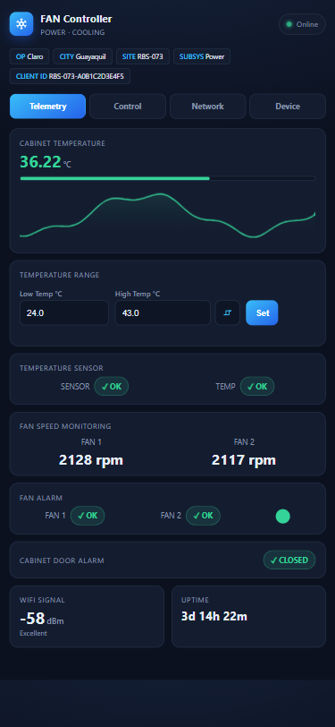
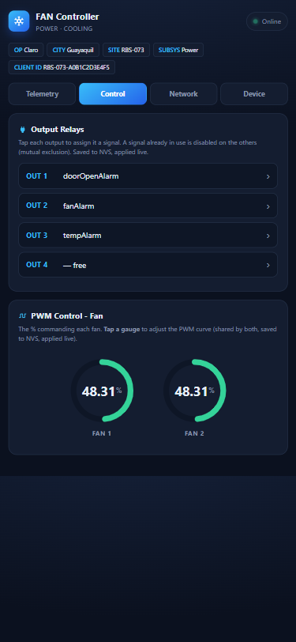
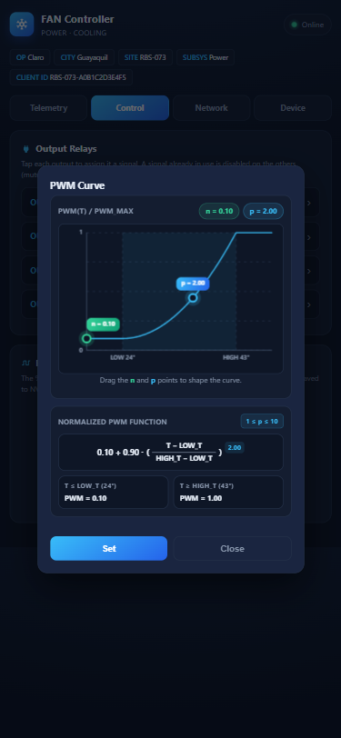
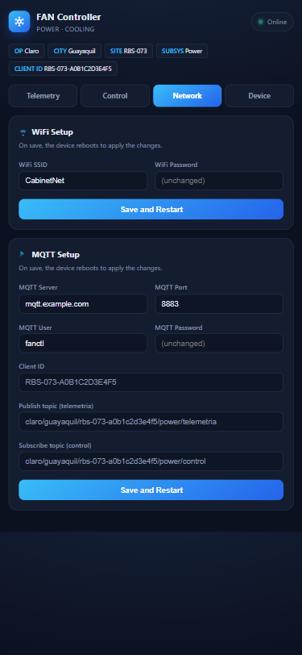
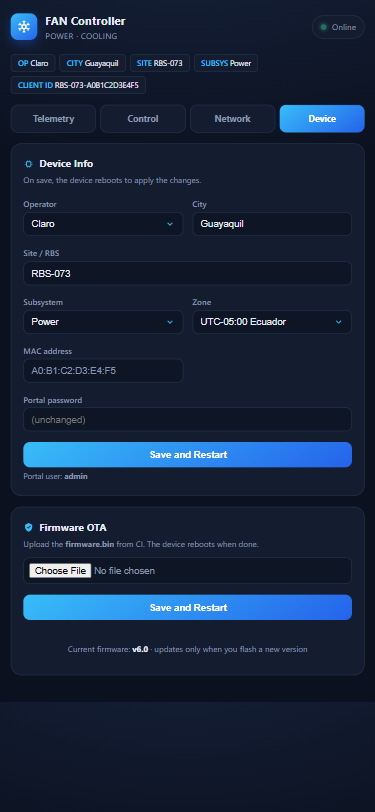
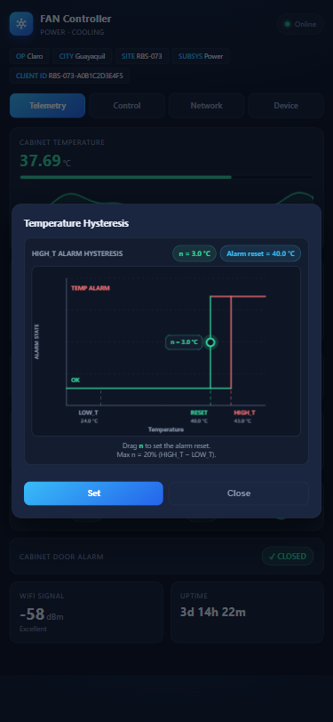
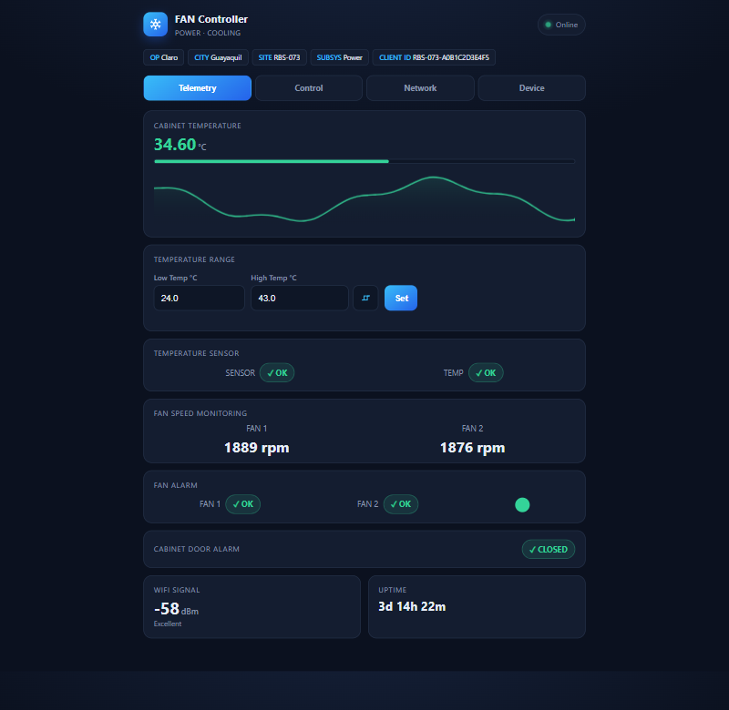
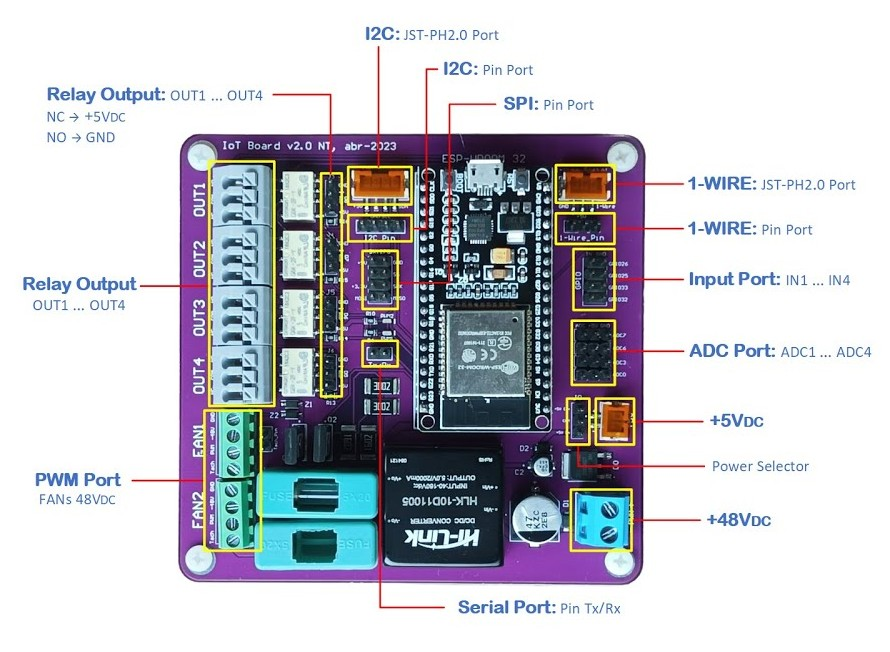
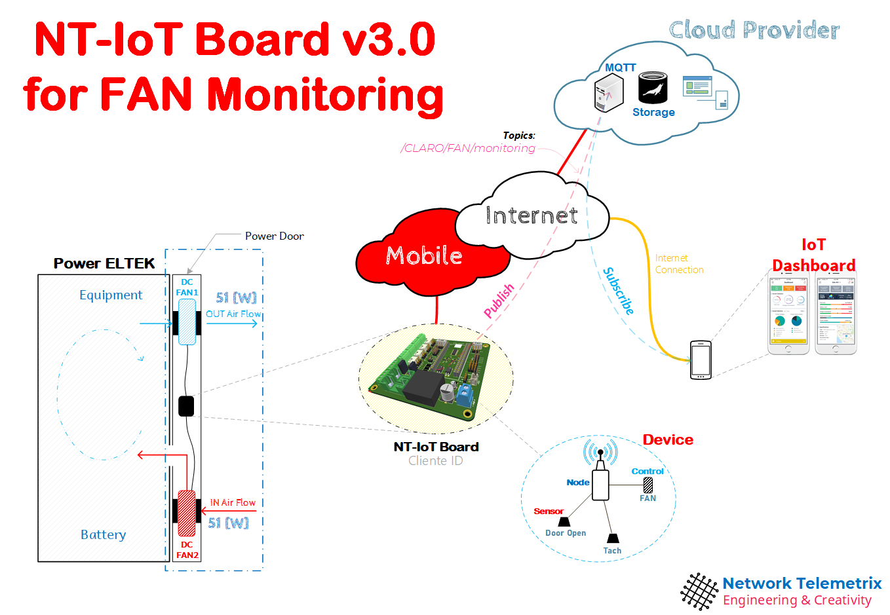

# NT FAN Controller

[](https://github.com/OctavioCriollo/nt-fan-controller/actions/workflows/build.yml)
[](https://github.com/OctavioCriollo/nt-fan-controller/releases)
[](https://github.com/pioarduino/platform-espressif32)

Production ESP32 firmware for the **NT-IoT Board v3.0** (Network Telemetrix) — a
temperature-driven PWM fan controller for telecom power cabinets (Power ELTEK
rectifiers). It replaces always-on cooling with a demand-driven curve, publishes
JSON telemetry over **MQTT/TLS**, and ships a **mobile-first web dashboard** for
live monitoring, tuning and OTA updates — every operating parameter is
runtime-configurable from the browser, no recompile in the field.

<p align="center">
  
  
  
</p>

## Highlights

- **Demand-driven cooling** — fan duty follows a configurable power-law curve
  `PWM = n + (1−n)·xᵖ` between the Low/High temperature thresholds
  (`p = 1` linear, `p = 2` parabolic; floor `n` for minimum airflow). Edited by
  **dragging two points on a live graph** in the dashboard.
- **Configurable alarm hysteresis** — the high-temperature alarm is a Schmitt
  trigger with a draggable reset band (clamped to 20 % of the range), so the
  alarm relay never chatters around the threshold.
- **Real fan feedback** — tachometer RPM per fan (IRAM ISR pulse counting with
  critical sections), with door-gated failure alarms and selectable general
  alarm logic (`FAN1 OR/AND FAN2`, single-fan).
- **Assignable relay outputs** — map temperature / door / fan alarms to any of
  the 4 relays from the dashboard, with mutual exclusion, persisted in NVS.
- **MQTT/TLS JSON telemetry** — CA-validated TLS, fleet-ready topic hierarchy,
  MAC-based client identity. **Verified against an EMQX broker.**
- **Zero-recompile operations** — WiFi, broker, identity, thresholds, curve,
  hysteresis and relay map all live in NVS, editable from the portal; control
  parameters apply live (no reboot).
- **Self-recovering** — thermal failsafe (fans → 100 % on sensor loss), WiFi
  AP-rescue mode with automatic STA recovery, hardware watchdog, SNTP time.
- **Browser OTA + CI/CD** — every push compiles on GitHub Actions; a `v*` tag
  publishes a release whose `.bin` uploads straight from the OTA page, with
  progress and success/error feedback.

## Web dashboard

A single self-contained page served from the ESP32 itself (PROGMEM, no
filesystem, no external assets, chunked streaming). Four tabs — **Telemetry /
Control / Network / Device** — with a 2-second data-only refresh (values update,
the layout never re-renders), snapshot restore on reload, and touch-optimized
controls. Works in station mode and in the rescue AP.

<p align="center">
  
  
  
</p>

<p align="center">
  
</p>

- **Telemetry** — cabinet temperature with history graph and level colors,
  sensor-health vs temperature-level badges, live thresholds (applied without
  reboot), per-fan RPM, fan/door alarms, WiFi signal, uptime.
- **Control** — live PWM gauges (tap → curve editor) and relay-output mapping.
- **Network** — WiFi and MQTT settings, each with its own save-and-restart;
  read-only client ID and pub/sub topics.
- **Device** — operator / city / site / subsystem identity, timezone, MAC,
  portal password and **Firmware OTA** with upload progress.

## Control math

**Fan curve** (both fans, applied every control cycle):

```
x   = (T − LOW_T) / (HIGH_T − LOW_T)          clamped to 0..1
PWM = PWM_MAX · ( n + (1 − n) · x^p )         n = floor 0..1, p = exponent 1..10
```

`T ≥ HIGH_T` → 100 %. `T ≤ LOW_T` → `n·PWM_MAX` (set `n = 0` for off when
cold). Defaults `n = 0.10`, `p = 1` reproduce a classic linear ramp.

**High-temperature alarm** (drives the mapped relay):

```
trip  ON  : T > HIGH_T
hold  ON  : T > HIGH_T − n        (n = reset band, default 3 °C)
reset OFF : T ≤ HIGH_T − n
```

Sensor failure (NAN / −127) is a separate alarm: fans failsafe to 100 % and the
`SENSOR` badge reports `FAILURE` while the temperature alarm reports honestly.

## MQTT telemetry

Topics are built at boot from the NVS identity (all lowercase):

```
<operator>/<city>/<site>-<MAC>/<subsystem>/telemetry   device → broker
<operator>/<city>/<site>-<MAC>/<subsystem>/control      broker → device
e.g. claro/guayaquil/rbs-073-a0b1c2d3e4f5/power/telemetry
```

The MQTT **client ID** is `<site>-<MAC>` — globally unique with zero per-board
configuration, so one firmware serves a whole fleet. Wildcard-friendly for
dashboards and ACLs: `claro/+/+/power/telemetry` = every power subsystem.

**Broker** — verified against **EMQX** over TLS (port 8883, username/password).
Any MQTT 3.1.1 broker works; the CA certificate compiled into the firmware
(`include/ca_cert.h`) must match your broker's certificate chain.

The device publishes one JSON document per cycle (representative, trimmed):

```json
{
  "id": "Controller",
  "model": "ESP_32",
  "mac": "A0:B1:C2:D3:E4:F5",
  "ip": "192.168.1.147",
  "timestamp": "2026-07-17T04:45:12",
  "sensors": [
    { "id": "temp1", "model": "DS18B20", "temperature": 36.52,
      "upper": 43.0, "lower": 24.0, "status": { "alm": false, "code": "OK" } },
    { "id": "fan1", "model": "TACHOMETER", "rpm": 2340,
      "status": { "alm": false, "code": "FAN1 ON" } },
    { "id": "fan2", "model": "TACHOMETER", "rpm": 2310,
      "status": { "alm": false, "code": "FAN2 ON" } },
    { "id": "doorOpenMon", "model": "DIGITAL_STATE", "state": false }
  ],
  "actuators": [
    { "id": "speedFan1", "model": "PWM", "value": 65.97 },
    { "id": "speedFan2", "model": "PWM", "value": 65.97 },
    { "id": "doorOpenAlarm", "model": "DIGITAL_CONTROL", "state": false },
    { "id": "fanAlarm",      "model": "DIGITAL_CONTROL", "state": true },
    { "id": "tempAlarm",     "model": "DIGITAL_CONTROL", "state": false }
  ]
}
```

Timestamps are real (SNTP, timezone configurable from the portal).

## Hardware — NT-IoT Board v3.0

Multipurpose plug-and-play IoT PCB (Network Telemetrix): −48 VDC (telecom) or
5 VDC supply with reverse-polarity and short-circuit protection.

| Resource | This firmware uses |
| --- | --- |
| 2 × PWM fan ports (48 V, fused) + tach inputs | both — speed command + RPM feedback |
| 4 × relay outputs (NC/COM/NO) | 3 mapped alarms + 1 spare (assignable) |
| 4 × digital inputs | 1 — cabinet door switch |
| 1-Wire port | DS18B20 cabinet temperature |
| I2C port | BME280 driver ready (temp/humidity/pressure) |
| 4 × analog inputs (ADC1), SPI, BT | available for future use |

[](https://www.youtube.com/watch?v=xHSDZ5ZZDWI)

*Click to watch the board overview on YouTube.*



## Getting started

```bash
cp secrets.example.h include/secrets.h     # first-boot defaults (WiFi/MQTT)
pio run -t upload                          # first flash over USB
```

After the first boot everything is managed from the portal:

1. If the configured WiFi is unreachable the board raises the
   **`FanController-Setup`** access point → portal at `http://192.168.4.1`.
2. On your LAN: `http://fan-controller.local` (HTTP Basic auth, `admin` +
   configurable password).
3. Subsequent updates: **Device → Firmware OTA** → upload the CI-built `.bin`.

> NVS wins over `secrets.h` after the first save — the compile-time values are
> first-boot defaults only.

## Architecture notes

- **pioarduino** platform (Arduino core 3.x / ESP-IDF 5.x), ArduinoJson 7,
  maintained `esp32async` web-server forks.
- Fan control runs in a dedicated **FreeRTOS task** decoupled from networking —
  a WiFi/MQTT outage can never stall thermal regulation.
- Tachometer pulses are counted in **IRAM ISRs** guarded by `portMUX` critical
  sections (read-and-clear is atomic; no lost edges).
- The dashboard page streams from PROGMEM via chunked responses with a
  size-tracking reserve — stable even on a fragmented heap.
- Single alarm channel per component (`status = {alm, code}`): intrinsic health
  is set by the driver, threshold policy by the control loop.

## Project ecosystem

This firmware is the **golden template** of the NT-IoT Board family. The shared
core (sensor/actuator classes, config store, MQTT, portal) is being extracted
into an **NT-core** library that the sibling firmwares (generator monitoring,
heater control) will consume. Full engineering documentation (design docs,
changelogs, audits, roadmaps) is maintained in the parent NT-IoT Board
workspace.

## Contributing

Contributions are welcome — open an issue or a pull request.
